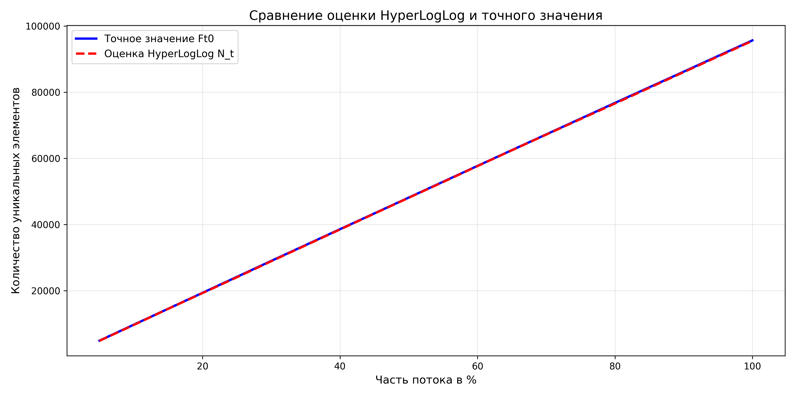
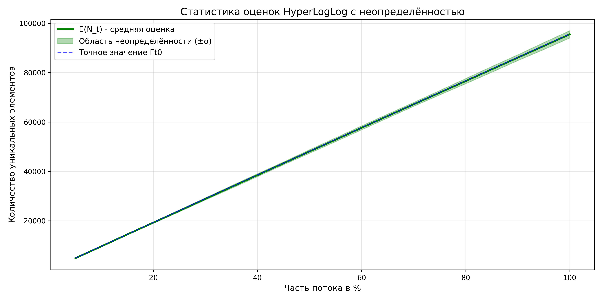
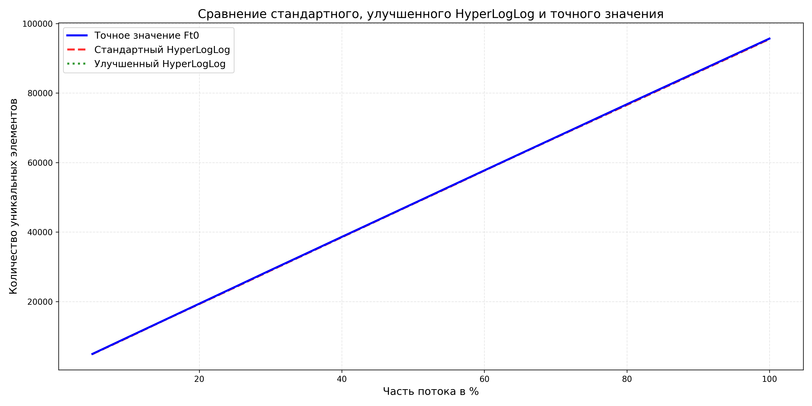
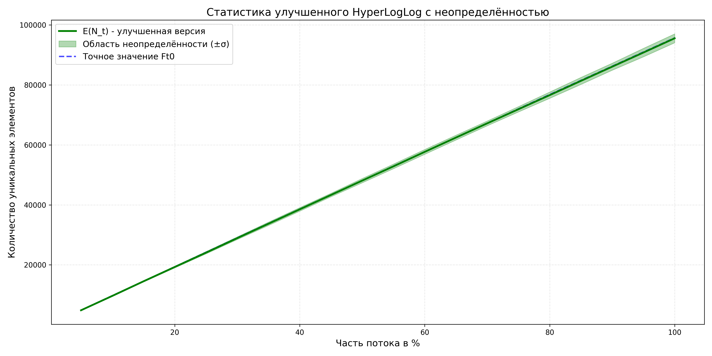
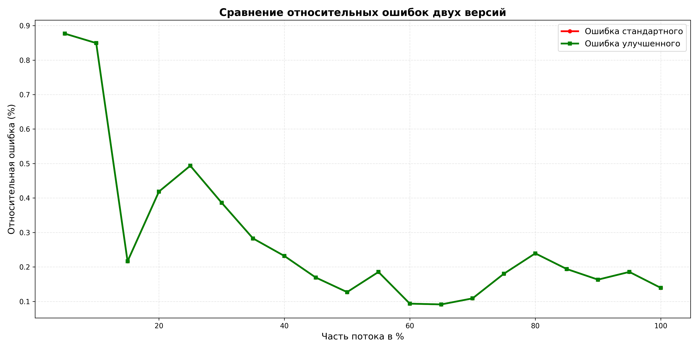
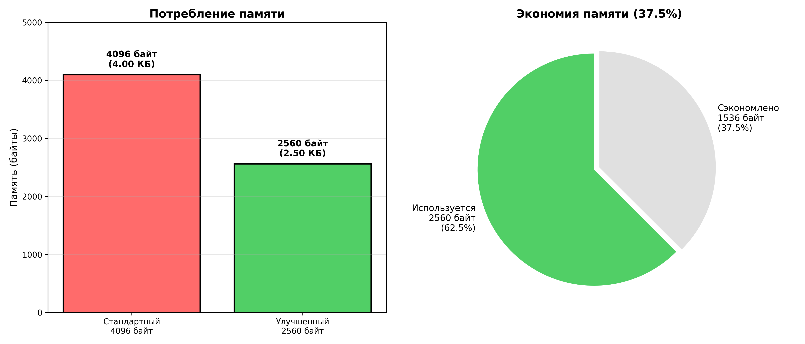

# HyperLogLog: исследование алгоритма подсчёта уникальных элементов в потоке
##
- ФИО: Саватеев Дмитрий Витальевич, БПИ248
- Ссылка на репозиторий: [https://github.com/savateevdmit/AaDS/tree/main/SET5/A3](https://github.com/savateevdmit/AaDS/tree/main/SET5/A3)

## Описание файлов

### Файлы алгоритмов, реализация на c++
| Файл | Описание |
|------|---------|
| `RandomStreamGen.h` | Класс для генерации потоков случайных строк длиной 1-30 символов |
| `HashFuncGen.h` | Реализация хеш-функции FNV |
| `HyperLogLog.h` | Основной класс алгоритма HyperLogLog |
| `HyperLogLogImproved.h` | Оптимизированная версия с упаковкой регистров по 5 бит вместо 8 |
| `ExactCounter.h` | Класс для подсчёта уникальных элементов |
| `main.cpp` | Основная программа для тестирования HyperLogLog |
| `main_improved.cpp` | Программа для сравнения стандартного и улучшенного HyperLogLog на одних и тех же потоках |
| `test_b_parameter.cpp` | Тестирования выбора параметра B (от 4 до 22) |
| `test_hash_uniformity.cpp` | Проверка равномерности распределения хеш-функции |

### Файлы с анализом, реализация на python

| Файл | Описание |
|------|---------|
| `plot_results.py` | Построение графиков |
| `plot_results_improved.py` | Построение графиков со сравнением стандартной и улучшенной версий |
| `analyze.py` | Анализ результатов работы стандартного алгоритма HyperLogLog |
| `analyze_improved.py` | Анализ результатов работы улучшенного алгоритма HyperLogLog |

### Данные экспериментов

| Файл | Описание |
|------|---------|
| `results.csv` | Основные результаты: точная оценка (exact), среднее значение оценки HyperLogLog (mean_estimate), стандартное отклонение (std_dev), границы доверительного интервала (lower_bound, upper_bound) для 20 точек прогресса потока (5%, 10%, ..., 100%) |
| `results_improved.csv` | Сравнительные результаты: оценки стандартного и улучшенного HyperLogLog на одних потоках данных |
| `b_parameter_test.csv` | Результаты тестирования выбора параметра B: средняя ошибка, стандартное отклонение, теоретическая граница для каждого значения B |

### Графики

| Файл | Описание |
|------|---------|
| `graph1_comparison.png` | График №1 сравнения оценки Nt и Ft0 |
| `graph2_statistics.png` | График №2 статистик оценки |
| `graph3_improved_comparison.png` | График №3 сравнение стандартного, улучшенного HyperLogLog и точного значения |
| `graph4_improved_statistics.png` | График №4 статистика улучшенного HyperLogLog с неопределённостью |
| `graph5_error_comparison.png` | График №5 сравнение относительных ошибок двух версий |
| `graph6_memory_savings.png` | График №6 визуализация экономии памяти |

---

## Этап 1:

### 1.1 Генератор потока данных

Реализован класс `RandomStreamGen`, который генерирует потоки случайных строк длиной от 1 до 30 символов. Допустимые символы включают прописные и строчные латинские буквы (a-z, A-Z), цифры (0-9) и символ дефиса. Класс поддерживает разбиение потока на части для моделирования времени t.

### 1.2 Хеш-функция

Реализована хеш-функция FNV , которая обеспечивает приблизительно равномерное распределение значений в диапазоне [0, 2³²)

## Этап 2:

### 2.1 Выбор параметра B

Параметр B определяет количество бит для индексирования субпотока и, следовательно, количество регистров m = 2^B. Выбор B критичен для баланса между точностью и потреблением памяти.

**Выбор В**: Проведены тестирования на 20 потоках размером 20000 элементов каждый с различными значениями B (от 4 до 22). Для каждого значения B вычислена средняя относительная ошибка и стандартное отклонение.

**Некоторые результаты тестирования при различных B:**
 (полные данные в csv файле)

| B | Память (байт) | Средняя ошибка | Теоретическая граница (1.04/sqrt(m) |
|---|---------------|----------------|----------------------------------|
| 10 | 1024 | 1.98% | 3.25% |
| 12| 4096 | 1.36% | 1.625% |
| 14 | 16384 | 0.55% | 0.8125% |
| 16 | 65536 | 0.20% | 0.406% |

**Обоснование выбора B = 12:**

Точность. Средняя ошибка при B = 12 составляет 1.36%, и находится в пределах теоретической границы 1.625% (1.04/sqrt(m))

Экономия памяти. Увеличение B до 14 снижает ошибку всего на 0.8% с 1.36% до 0.55%, но потребление памяти возрастает в 4 раза до 16 КБ, для потоковых алгоритмов, где память критически важна, это неоправданно 
  P.S. а тем более сейчас, память всё-таки не дешёвая)

Стабильность. Стандартное отклонение ошибки составляет 0.95%, а значит результаты между запусками устойчивы, следовательно алгоритм предсказуем в своём поведении

## Выводы по графикам

### График 1: Сравнение оценки и точного значения

По графику видно, что красная пунктирная линия (оценка HyperLogLog) практически совпадает с синей линией (точное значение) на всём протяжении потока от 5% до 100%, следовательно алгоритм даёт точные оценки на малых объёмах обработанного потока и сохраняет высокую точность с ростом потока

### График 2: Статистика оценок HyperLogLog с неопределённостью

На графике видно, что точное значение (синяя пунктирная линия) всегда находится внутри зелёной закрашенной области неопределённости. Область неопределённости узкая и расширяется пропорционально росту количества элементов, зелёная линия (средняя оценка) практически совпадает с точным значением, значит алгоритм стабилен и предсказуем

## Этап 3:

На 50 потоках размером 100000 элементов с параметром B = 12 получены следующие результаты:

### 3.1 Точность разработанного алгоритма
- **Средняя относительная ошибка**: 0.2817%
- **Максимальная ошибка**: 0.8767%
- **Минимальная ошибка**: 0.0914%

**Сравнение с теоретическими отклонениями:**
- Теоретическое отклонение (1.04/sqrt(m)): 1.6250%
- Теоретическое отклонение (1.3/sqrt(m)): 2.0312%

Фактическая средняя ошибка значительно ниже обеих теоретических отклонений

### 3.2 Стабильность оценки (дисперсия)
- **Средний коэффициент вариации**: 1.4482%
- **Минимальное стандартное отклонение**: 70.56 элементов на 5% потока
- **Максимальное стандартное отклонение**: 1480.49 элементов на 100% потока
- **Средняя ширина доверительного интервала (±σ)**: 2.8963% от оценки

### 3.3 Эффективность выбранных констант

**Параметр B = 12:**
- Количество регистров: m = 2¹² = 4096
- Потребление памяти: 4096 байт = 4 КБ
- Время добавления элемента: O(1)

**Коррекции границ:**

Алгоритм использует два вида коррекций. Для малых значений E(m) ≤ 2.5m применяется логарифмическая коррекция E' = m · ln(m/V), где V это количество нулевых регистров. Для больших значений E(m) > (1/30)·2³² используется экспоненциальная коррекция E' = -2³² · ln(1 - E/2³²). Эти коррекции повышают точность на краях диапазона значений и объясняют, почему фактическая ошибка 0.28% намного ниже теоретической границы 1.63%

---

## Этап 4:
### 4.1 Суть модификации

Суть модификации заключается в экономии памяти, стандартная реализация хранит каждый регистр в виде `uint8_t` (8 бит), хотя для B=12 максимальным значением в регистре является количество ведущих нулей в (32-B) = 20 битах, то есть максимум 21. Для хранения чисел от 0 до 31 достаточно 5 бит

В оптимизированной версии `HyperLogLogImproved` регистры упакованы по 5 бит в `std::vector<uint8_t>`. Это снижает требуемый размер памяти с 4096 байт до 2560 байт, достигая экономии 37.5%. Реализованы функции `getRegister()` и `setRegister()` для безопасного чтения и записи 5-битных значений с учётом границ байтов

### 4.2 Сравнение

**Потребление памяти:**

| Версия | Размер (байт) | Размер (КБ) |
|--------|---------------|-------------|
| Стандартный | 4096 | 4.00 |
| Улучшенный | 2560 | 2.50 |
| **Экономия** | **1536** | **37.50%** |

**Точность (средняя относительная ошибка):**

| Версия | Средняя ошибка | Максимальная ошибка |
|--------|---|---|
| Стандартный | 0.2817% | 0.8767% |
| Улучшенный | 0.2817% | 0.8767% |
| Разница | 0.0000% | 0.0000% |

**Стабильность (коэффициент вариации):**

| Версия | Средний CV | Min std_dev | Max std_dev |
|--------|---|---|---|
| Стандартный | 1.4482% | 70.56 | 1480.49 |
| Улучшенный | 1.4482% | 70.56 | 1480.49 |
| Разница | 0.0000% | 0.0000% | 0.0000% |

Улучшенная версия не уступает по точности и стабильности при экономии 37.5% памяти. На графике видно, что все три линии совпадают, то есть оптимизация памяти не повлияла на точность

На графике статистики улучшенной версии зелёная линия E(N_t) полностью совпадает с точным значением (синяя пунктирная), область неопределённости ±σ узкая и стабильна на всём протяжении обработки потока

На графике сравнения ошибок красная и зелёная линии накладываются друг на друга, что ещё раз доказывает отсутствие различий в точности

На графике потребления памяти видно снижение с 4096 до 2560 байт

### 4.3 Анализ

**Точность и стабильность**: Средняя относительная ошибка улучшенной версии составляет 0.2817% как и у стандартной версии, поскольку 5-битное представление полностью покрывает все возможные значения регистров для B=12 так как максимальное значение регистра (21) с запасом помещается в 5 бит. Коэффициент вариации остаётся на уровне 1.4482% для обеих версий

**Эффективность**: При идентичных показателях точности и стабильности улучшенная версия экономит 37.5% памяти, что значительно при обработки больших объёмов информации
